# S&P 500 Quant Signal

<p align="center">
  <strong>출처·기준일·결측을 숨기지 않는 로컬 우선 S&P 500 퀀트 리서치 서비스</strong><br>
  같은 규칙으로 종목을 비교하고, 점수의 근거를 종목 상세 화면에서 다시 확인합니다.
</p>

<p align="center">
  <a href="https://github.com/Kimhyuntae9665/sp500-quant-signal/actions/workflows/ci.yml"></a>
  
  
  
  
  
</p>

<p align="center">
  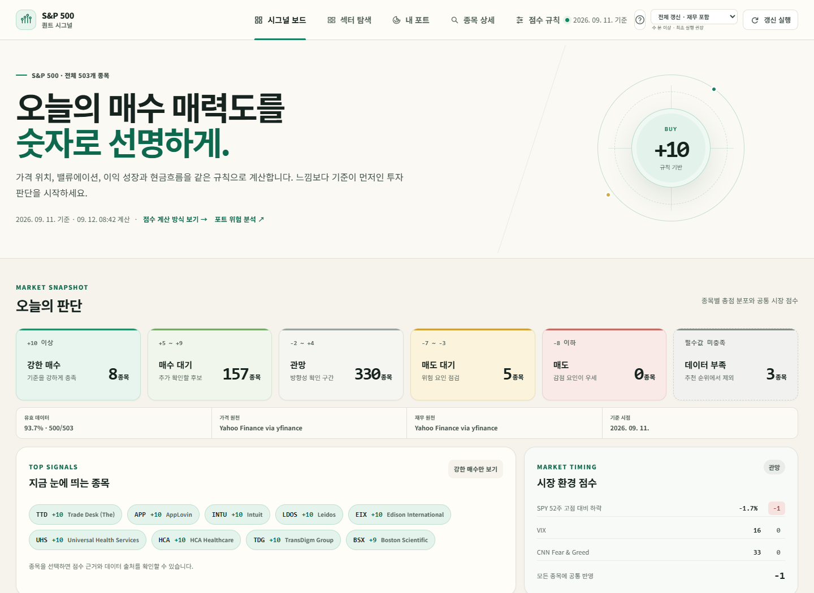
</p>

> 화면 캡처 기준: **2026-09-12 KST**. 주가·종목 수·점수·포트폴리오 평가액과 위험 지표는 공급자 갱신 시점에 따라 달라집니다. 캡처 속 포트폴리오는 UI 검증을 위한 예시이며 실제 계좌, 매수 권유 또는 성과 자료가 아닙니다.

## 목차

- [프로젝트 개요](#프로젝트-개요)
- [화면 둘러보기](#화면-둘러보기)
- [점수 모델](#점수-모델)
- [주요 기능](#주요-기능)
- [데이터 출처와 계약](#데이터-출처와-계약)
- [아키텍처](#아키텍처)
- [설치와 실행](#설치와-실행)
- [데이터 갱신](#데이터-갱신)
- [API](#api)
- [Android 앱](#android-앱)
- [테스트와 검증](#테스트와-검증)
- [보안과 공개 범위](#보안과-공개-범위)
- [알려진 한계](#알려진-한계)

## 프로젝트 개요

S&P 500 구성 종목을 동일한 정량 규칙으로 계산해 조사 우선순위를 좁히는 개인 연구용 웹 서비스입니다. 단순히 종합 점수만 보여 주지 않고 다음 질문에 답할 수 있도록 만들었습니다.

- 이 종목은 **어떤 지표에서 몇 점**을 받았는가?
- 그 값의 **기준일·출처·상태**는 무엇인가?
- 값이 없을 때 0으로 처리했는가, 아니면 **N/A로 보류**했는가?
- 현재 PER과 과거 구간은 실제로 어떻게 달라졌는가?
- 여러 종목을 한 규칙으로 비교하되 업종별 해석 차이를 어디까지 남겼는가?

| 구분 | 현재 구현 |
|---|---|
| 스크리닝 범위 | 조회 시점의 S&P 500 구성 티커 스냅샷 |
| 회사 점수 | 9개 지표, 최소 5개 유효 지표 필요 |
| 시장 환경 | SPY 고점 대비 하락, VIX, Fear & Greed 3개 보조 점수 |
| 종목 이력 | 최근 3년 가격·Wilder RSI(14), 약 5년 주간 Trailing/Forward PER |
| 분류 | M7·소프트웨어 테마와 GICS 11개 섹터 |
| 포트폴리오 | 미국 상장주식·ETF, KOSPI, KRX 금, 원화 현금 |
| 리스크 분석 | 2~12개 미국 자산의 변동성·낙폭·베타·VaR·ES·위험기여·상관 |
| 실행 형태 | 로컬 웹/PWA + Android WebView 클라이언트 |
| 저장 | 서버 데이터는 SQLite 캐시, 포트 입력은 브라우저 `localStorage` |
| 현재 QA | Python 단위·계약 테스트 85개 + JavaScript 구문 검사 + 실제 브라우저 화면 검수 |

이 서비스는 자동 주문, 목표가 산출, 수익 보장 또는 개인화 투자자문을 제공하지 않습니다.

## 화면 둘러보기

### 1. 섹터·테마 탐색과 점수 규칙

M7·소프트웨어 테마 또는 GICS 섹터를 선택해 종목표를 좁힐 수 있습니다. 표의 각 열을 누르면 종합 점수와 무관하게 해당 지표 기준 오름차순·내림차순으로 정렬됩니다.

<p align="center">
  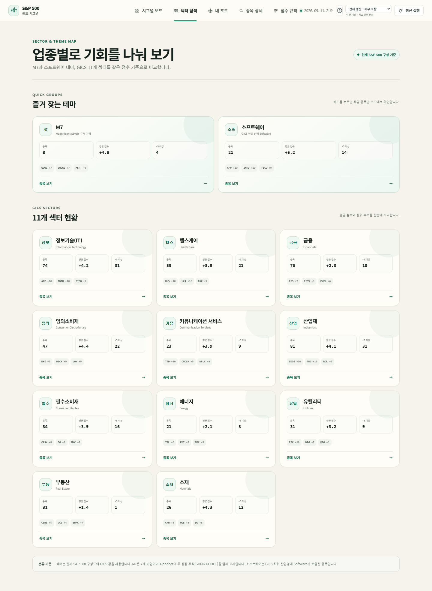
</p>

점수 규칙은 별도 화면에서 경계값·가감점·제외 업종까지 확인할 수 있습니다. 화면 설명은 `/api/rules`가 반환하는 버전된 엔진 규칙을 사용합니다.

<p align="center">
  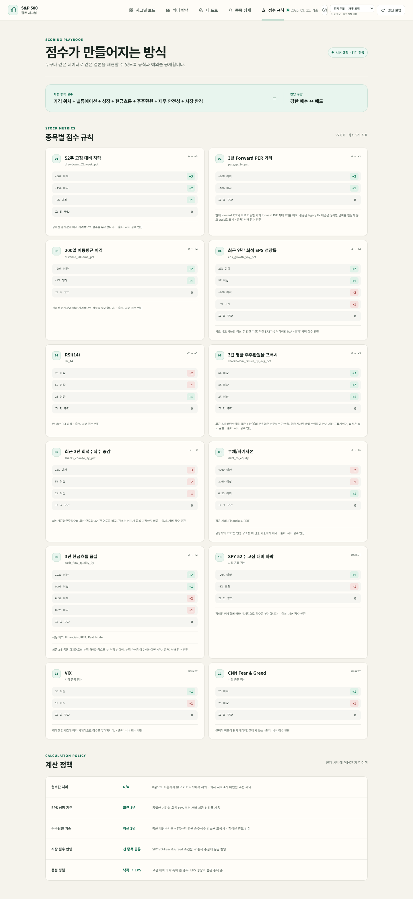
</p>

### 2. 종목 상세와 약 5년 주간 PER

종목 행의 오른쪽 화살표를 누르면 점수 기여도, 가격과 RSI, 연간 희석 EPS 성장, 희석주식수, 현금흐름 품질과 valuation 이력을 한 화면에서 확인할 수 있습니다.

<p align="center">
  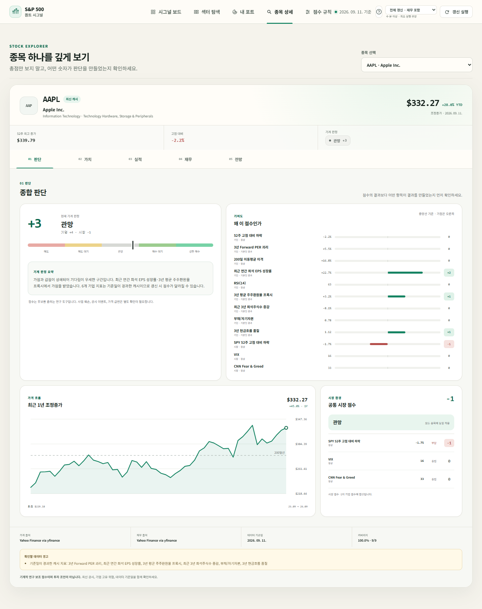
</p>

Trailing/Forward PER 차트는 연도 평균값 몇 개가 아니라 Yahoo의 매주 마지막 거래일 가격을 이용한 약 5년 주간 시계열입니다. 다만 Forward PER은 과거 매주 보존된 컨센서스 원본이 아니라 StockAnalysis의 분기 앵커에서 추정한 Forward EPS 분모를 다음 앵커까지 유지하는 **가격 민감도 프록시**입니다.

<p align="center">
  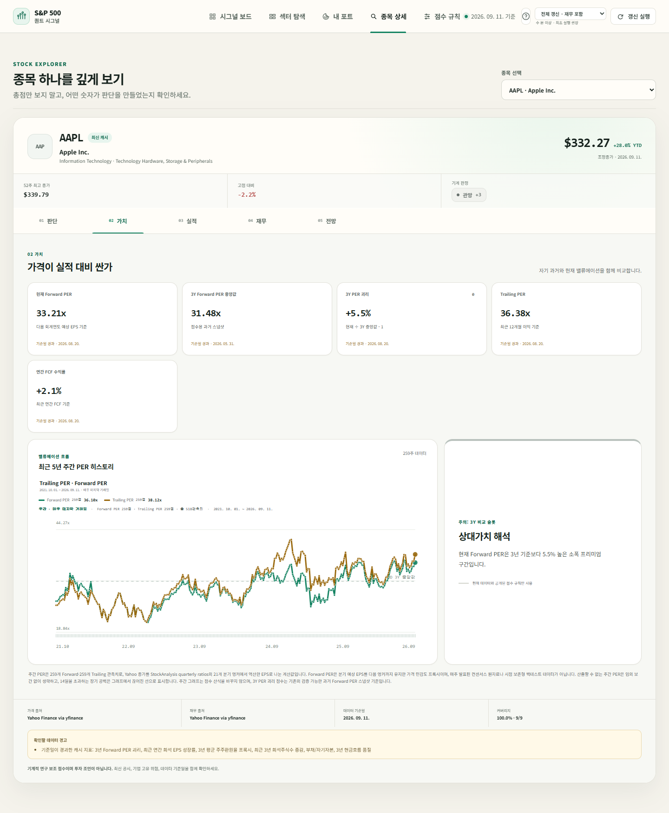
</p>

### 3. 내 포트 시각화

미국 주식·ETF, KOSPI, KRX 금과 원화 현금을 한 화면에서 원화 기준으로 구성합니다. 종목별 색상을 구분한 도넛 차트와 시장별 그룹 트리맵을 함께 제공합니다.

<p align="center">
  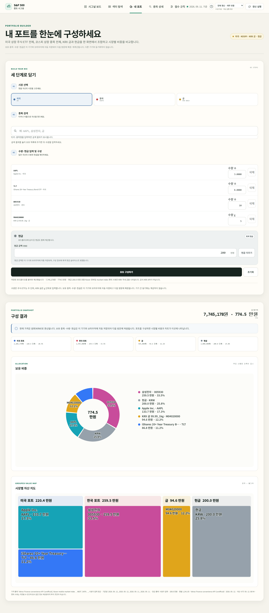
</p>

위 화면의 AAPL·TLT·삼성전자·KRX 금·현금 조합은 기능 시연용 입력입니다. 실제 보유 내역이나 추천 포트폴리오가 아닙니다.

### 4. GS Quant Risk Lab

미국 자산 2~12개의 비중을 입력하면 공통 완료 거래일 기준으로 위험 통계와 상관 구조를 계산합니다. 공개된 `gs-quant` 시계열 통계 함수를 로컬에서 사용하며 Goldman Sachs Marquee 계정이나 기관용 데이터에는 연결하지 않습니다.

<p align="center">
  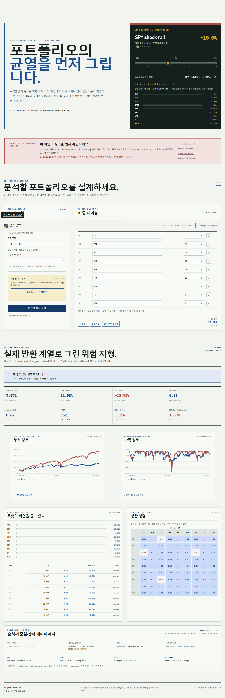
</p>

### 5. 모바일 반응형 화면

390×844 모바일 뷰포트에서 대시보드, 섹터, 상세, valuation, 포트폴리오와 리스크 결과를 각각 검수했습니다.

<p align="center">
  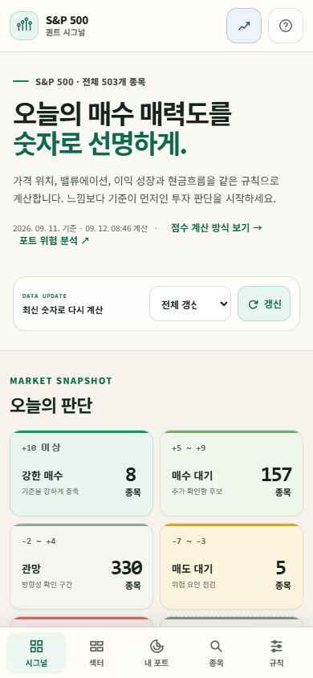
  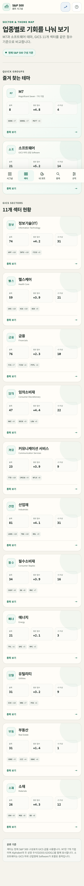
  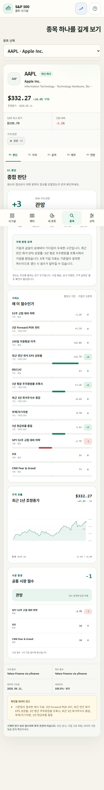
</p>

<p align="center">
  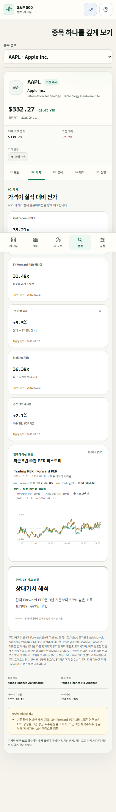
  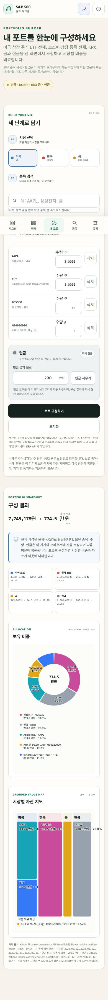
  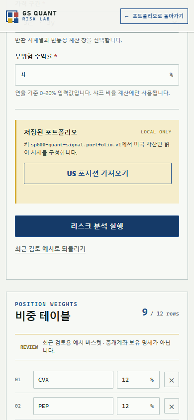
</p>

<p align="center">
  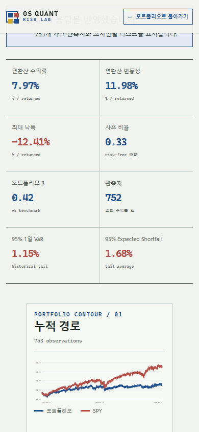
</p>

### 6. Galaxy Android 앱

Android 앱은 계산 엔진을 휴대폰에 복제하지 않고 개인 PC 서버를 안전한 사설망 주소로 여는 가벼운 WebView 클라이언트입니다. API 24(Android 7.0) 이상, target SDK 34로 구성되어 있습니다.

<p align="center">
  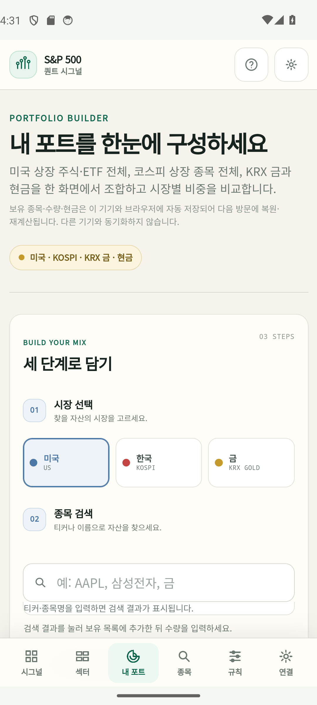
  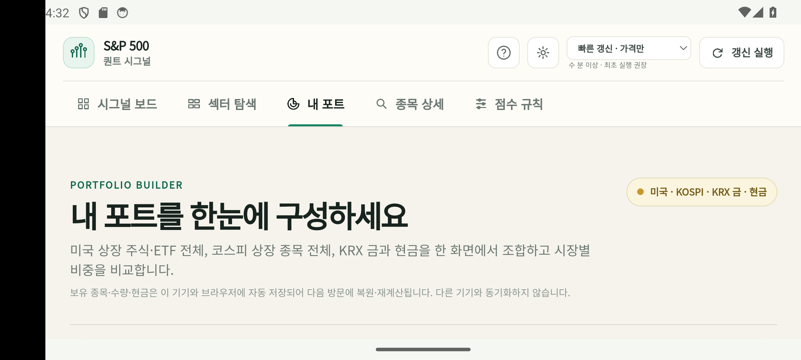
</p>

## 점수 모델

종합 결과는 회사별 9개 지표와 시장 환경 3개 지표의 합으로 계산합니다. 회사 지표가 5개 미만이면 결측치를 0점으로 채워 순위를 만들지 않고 `데이터 부족`으로 분리합니다.

### 회사 점수 9개

| 지표 | 가점·감점 규칙 | 핵심 해석 |
|---|---|---|
| 52주 고점 대비 하락률 | `≤ -30%: +3`, `≤ -15%: +2`, `≤ -5%: +1` | 가격 조정 폭. 낙폭 자체가 저평가를 보장하지 않음 |
| 3년 Forward PER 괴리 | `≤ -20%: +2`, `≤ -10%: +1` | 현재 Forward PER과 비교 가능한 과거 스냅샷 중앙값의 괴리 |
| 200일 이동평균 이격 | `≤ -20%: +2`, `≤ -5%: +1` | 장기 추세 대비 현재 위치 |
| 최근 연간 희석 EPS 성장 | `≥ 20%: +2`, `≥ 5%: +1`, `≤ -5%: -1`, `≤ -20%: -2` | 최근 비교 가능한 연간 EPS 변화 |
| Wilder RSI(14) | `≤ 25: +1`, `≥ 65: -1`, `≥ 75: -2` | 단기 과매도·과열 보조 신호 |
| 3년 주주환원 프록시 | `≥ 6%: +3`, `≥ 4%: +2`, `≥ 2%: +1` | 평균 배당수익률 + 양의 연평균 희석주식수 감소율 |
| 3년 희석주식수 변화 | `≥ 1%: -1`, `≥ 5%: -2`, `≥ 10%: -3` | 누적 희석 증가에 대한 감점 |
| 부채/자기자본 | `≤ 0.25: +1`, `≥ 2: -1`, `≥ 4: -2` | 레버리지 보조 지표. 금융·REIT 제외 |
| 3년 현금흐름 품질 | `≥ 1.2: +2`, `≥ 0.9: +1`, `≤ 0.75: -1`, `≤ 0.5: -2` | 3개 공통 회계연도 누적 OCF ÷ 누적 순이익. 금융·REIT·부동산 제외 |

섹터 내 상대가치, S&P 500 상대 모멘텀과 시가총액은 현재 점수에서 제외했습니다. 캐시나 내부 모델에 호환용 원천값이 남아 있더라도 점수 구성요소나 화면 신호로 해석하지 않습니다.

### 시장 환경 점수 3개

| 지표 | 가점·감점 규칙 |
|---|---|
| SPY 고점 대비 하락 | `≤ -20%: +1`, `> -5%: -1` |
| VIX | `≥ 30: +1`, `≤ 12: -1` |
| CNN Fear & Greed | `≤ 25: +1`, `≥ 75: -1` |

### 추천 단계

| 종합 점수 | 표시 단계 |
|---:|---|
| `10점 이상` | 적극 매수 관찰 |
| `5~9점` | 매수 대기 |
| `-2~4점` | 중립 |
| `-7~-3점` | 매도 주의 |
| `-8점 이하` | 매도 관찰 |

단계 이름은 조사 우선순위를 위한 UI 라벨입니다. 매수·매도 지시가 아니며 투자기간, 세금, 위험 감내도, 포지션 크기를 반영하지 않습니다. 최종 규칙의 단일 기준은 실행 코드와 `GET /api/rules` 응답입니다.

## 주요 기능

### 스크리너

- 전체 S&P 500 티커에 동일한 규칙 적용
- 종합 점수·개별 지표별 양방향 정렬
- 검색, 추천 단계, GICS 섹터와 M7·소프트웨어 테마 필터
- 유효 지표 수와 데이터 품질 상태 표시
- 각 값의 `as_of`, `source`, `stale`, 오류·경고 메타데이터 보존

### 종목 상세

- 최근 3년 가격과 Wilder RSI(14)
- 약 5년 주간 Trailing/Forward PER
- 최근 연간 희석 EPS와 성장률
- 3년 희석가중평균주식수 변화
- 영업현금흐름·잉여현금흐름·순이익과 현금흐름 전환율
- 지표별 점수 기여도와 제외·결측 이유

### 포트폴리오 시각화

- 미국 거래소 상장 주식·ETF 검색
- KOSPI 종목 검색과 `.KS` 시세 정규화
- KRX 금시장 1g 단위와 원화 현금 입력
- USD/KRW 환율을 이용한 원화 평가액 통일
- 종목별 도넛, 시장별 트리맵, 실패한 시세 항목 별도 표시
- 선택 종목·수량·현금의 브라우저 자동 저장

저장값은 현재 브라우저 또는 Android WebView의 `localStorage`에만 남습니다. PC와 휴대폰 사이에 동기화되지 않으며, 앱 데이터 삭제 시 함께 사라집니다. 시세·환율·계산 결과·접근 토큰은 `localStorage`에 저장하지 않습니다.

### 리스크 랩

- 연율화 수익률·변동성, 최대낙폭, Sharpe, SPY 베타
- 역사적 VaR·Expected Shortfall
- 구성자산별 변동성·베타·위험기여도
- 포트폴리오 누적수익률·낙폭과 상관행렬
- 공통 완료 거래일 60개 미만 분석 거부
- 뉴욕 정규장 당일 일봉을 16:15 ET 전까지 제외

자세한 계산 계약은 [GS Quant Risk Lab 문서](docs/GS_QUANT_LAB.md)를 확인하세요.

## 데이터 출처와 계약

| 영역 | 편의 공급자 | 사용 방식 | 신뢰도 경계 |
|---|---|---|---|
| S&P 500 구성 | Wikipedia 현재 구성 표·저장된 스냅샷 | 티커·회사·GICS 분류 | 지수 권위자는 S&P Dow Jones Indices이며 현재 구현은 공식 라이선스 피드가 아님 |
| 미국 가격·펀더멘털 | Yahoo Finance via `yfinance` | 가격, PER, 재무제표, 배당·분할 이벤트 | 거래소·SEC 공식 데이터가 아닌 비공식 편의 계층 |
| 약 5년 valuation 앵커 | StockAnalysis 분기 비율 페이지 | 분기 Last Close/PE/Forward PE에서 이익 분모 역산 | 비율은 공급자 계산값이며 SEC 보고 항목 자체가 아님 |
| KOSPI 종목 목록 | FinanceDataReader KRX 캐시 미러 | STK/KOSPI 행 검색 | 공식 KRX Open API 응답이 아닌 제3자 미러 |
| KRX 금 표시값 | Naver 모바일 국내 금 편의 시세 | 1g 원화 가격 | KRX 직접 체결 데이터가 아님 |
| 시장 심리 | CNN Fear & Greed 편의 endpoint | 선택적 시장 환경 점수 | endpoint와 방법론이 변경될 수 있으며 실패 시 N/A |
| 리스크 함수 | `goldmansachs/gs-quant` 2.1.6 | 공개 시계열 통계 함수 | Marquee 기관 데이터·계정·주문 기능을 사용하지 않음 |

모든 핵심 값은 가능하면 다음 메타데이터를 함께 전달합니다.

```json
{
  "value": 12.34,
  "unit": "%",
  "as_of": "2026-09-11",
  "source": "Yahoo Finance via yfinance",
  "status": "ok",
  "notes": []
}
```

- **결측은 0이 아닙니다.** 확인되지 않은 배당·PER·EPS를 임의로 0 또는 과거값으로 채우지 않습니다.
- 갱신 실패 시 기존 캐시를 사용할 수 있지만 `stale`과 실패 이유를 표시합니다.
- 전체 수집 중 한 종목이 실패해도 다른 종목 결과와 캐시를 보존합니다.
- 상세 차트용 데이터는 사용자가 종목을 열 때 필요한 범위만 별도 수집·캐시합니다.
- 재무 숫자를 실제 투자 판단에 사용하기 전에는 SEC EDGAR의 10-K·10-Q·8-K와 기업 IR로 재확인해야 합니다.

세부 정의는 [데이터 및 리스크 문서](docs/DATA_AND_RISK.md)에 더 길게 정리되어 있습니다.

## 아키텍처

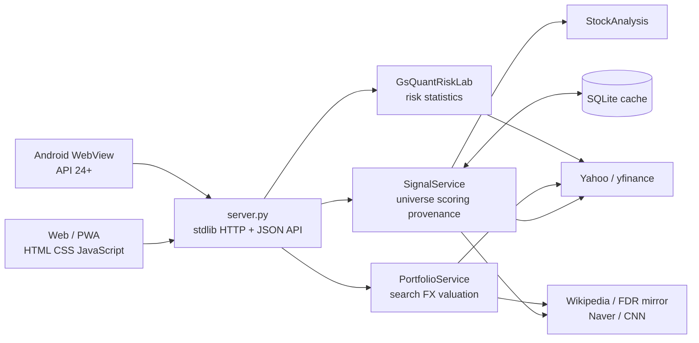

### 요청 흐름

1. 브라우저와 Android 앱은 같은 출처의 `/api/*`만 호출합니다.
2. `server.py`가 입력 형식·티커·요청 크기·토큰을 검증합니다.
3. 점수, 포트폴리오와 리스크 서비스를 분리해 한 기능의 공급자 장애가 전체 UI를 막지 않도록 합니다.
4. 점수 엔진은 구성 종목, 가격, 펀더멘털과 시장 지표를 독립 캐시 키로 저장합니다.
5. 응답은 계산값뿐 아니라 출처·기준일·결측·경고를 함께 전달합니다.
6. 긴 새로고침은 백그라운드 스레드에서 수행하고 HTTP 요청에는 즉시 `202 Accepted`를 반환합니다.

코드 경계와 JSON 계약은 [아키텍처 문서](docs/ARCHITECTURE.md)를 참고하세요.

## 설치와 실행

### 요구 사항

- Python 3.11 이상 권장
- Windows PowerShell 5.1 이상 또는 PowerShell 7
- 최초 데이터 갱신을 위한 인터넷 연결

### 1. 저장소 복제

```powershell
git clone https://github.com/Kimhyuntae9665/sp500-quant-signal.git
Set-Location .\sp500-quant-signal
```

### 2. 가상환경과 의존성

```powershell
py -3 -m venv .venv
& .\.venv\Scripts\python.exe -m pip install --upgrade pip
& .\.venv\Scripts\python.exe -m pip install -r .\requirements.txt
```

### 3. 서버 실행

```powershell
.\run.ps1
```

브라우저에서 <http://127.0.0.1:8765>를 엽니다. 기본 실행은 소켓을 먼저 연 뒤 `quick` 갱신을 백그라운드에서 시작합니다.

실행 정책으로 차단될 때는 현재 실행에만 우회 정책을 적용할 수 있습니다.

```powershell
powershell -NoProfile -ExecutionPolicy Bypass -File .\run.ps1
```

Python으로 직접 실행할 수도 있습니다.

```powershell
& .\.venv\Scripts\python.exe .\server.py `
  --host 127.0.0.1 `
  --port 8765 `
  --refresh-on-start quick
```

상태 확인:

```powershell
Invoke-RestMethod -Uri "http://127.0.0.1:8765/api/health"
```

종료는 서버 터미널에서 `Ctrl+C`를 누릅니다.

### Windows 로그인 시 자동 실행

```powershell
powershell -NoProfile -ExecutionPolicy Bypass -File .\install-local-autostart.ps1
```

예약 작업은 `127.0.0.1:8765`에서 실행되므로 Wi-Fi가 바뀌어도 같은 PC에서는 주소가 유지됩니다. 인터넷이 끊기면 기존 캐시는 볼 수 있지만 새 데이터 갱신은 실패할 수 있습니다.

제거:

```powershell
powershell -NoProfile -ExecutionPolicy Bypass -File .\uninstall-local-autostart.ps1
```

## 데이터 갱신

| 모드 | 범위 | 권장 용도 |
|---|---|---|
| `none` | 네트워크 수집 없이 기존 캐시만 사용 | 오프라인 확인·UI 개발 |
| `quick` | 전체 종목 가격, SPY, VIX, 선택적 Fear & Greed | 장중·일상 업데이트 |
| `full` | `quick` + 종목별 펀더멘털 | 최초 구성·재무자료 갱신 |

기본 가격 TTL은 6시간, 펀더멘털 TTL은 24시간입니다. TTL 판단은 종목별 캐시 키 단위로 수행됩니다. 공급자 호출 제한 때문에 전체 `full` 갱신은 오래 걸리거나 일부 실패할 수 있으므로 작은 범위로 먼저 확인할 수 있습니다.

```powershell
# 25개 종목 가격 갱신
Invoke-RestMethod -Method Post `
  -Uri "http://127.0.0.1:8765/api/refresh" `
  -ContentType "application/json" `
  -Body '{"mode":"quick","limit":25}'

# 10개 종목 펀더멘털 포함 점검
Invoke-RestMethod -Method Post `
  -Uri "http://127.0.0.1:8765/api/refresh" `
  -ContentType "application/json" `
  -Body '{"mode":"full","limit":10}'

# 현재 구성 전체 펀더멘털 갱신
Invoke-RestMethod -Method Post `
  -Uri "http://127.0.0.1:8765/api/refresh" `
  -ContentType "application/json" `
  -Body '{"mode":"full"}'
```

동시에 두 갱신을 실행하지 않습니다. 접수 성공은 `202`, 이미 진행 중이면 `409`이며 상태와 마지막 결과는 `/api/health` 및 `/api/dashboard`의 `refresh` 필드에서 확인합니다.

## API

| 메서드 | 경로 | 설명 |
|---|---|---|
| `GET` | `/api/health` | 엔진·포트폴리오·리스크 랩 준비 상태와 갱신 상태 |
| `GET` | `/api/dashboard` | 스크리닝 결과, 품질 메타데이터와 갱신 상태 |
| `GET` | `/api/rules` | 점수 규칙 버전, 회사·시장 규칙과 추천 구간 |
| `GET` | `/api/stocks/{ticker}` | 정규화한 단일 티커 신호 |
| `GET` | `/api/stocks/{ticker}/history` | 3년 가격·RSI와 약 5년 주간 PER 이력 |
| `GET` | `/api/portfolio/search?market=us\|kospi\|gold&q=...&limit=12` | 시장별 종목 검색 |
| `POST` | `/api/portfolio/compose` | 보유 수량과 선택적 `cash_krw`의 원화 구성 |
| `POST` | `/api/gs-quant/analyze` | 미국 자산 비중의 위험·시계열·상관 분석 |
| `POST` | `/api/refresh` | `quick` 또는 `full` 비동기 갱신 시작 |

오류 응답은 UI가 분기할 수 있도록 안정된 `error.code`와 사용자 표시용 `error.message`를 포함합니다. 공급자 예외 원문이나 로컬 경로는 공개 API 응답에 노출하지 않습니다.

## Android 앱

`android-app/`은 현재 웹 UI를 Samsung Galaxy를 포함한 Android 기기에서 여는 전용 클라이언트입니다.

- `applicationId`: `com.hyuntae.quantviewer`
- `minSdk`: 24
- `targetSdk` / `compileSdk`: 34
- 현재 앱 버전: 1.1.0
- 요구 빌드 도구: JDK 17, Android SDK Platform 34, Build Tools 34.0.0

```powershell
Set-Location .\android-app
.\build-apk.ps1 release
```

개인 서버의 접속 주소와 토큰은 빌드 시 로컬의 Git 제외 파일을 사용합니다. APK, 키 저장소, `private.properties`, `local.properties`, 접속 URL 파일은 이 저장소에 포함하지 않습니다. 외부 접속 구성과 직접 설치 절차는 [Android 앱 안내](android-app/README.md)를 확인하세요.

## 테스트와 검증

2026-09-12 공개 전 로컬 검증 결과:

```text
Ran 85 tests in 5.486s
OK
```

재실행:

```powershell
& .\.venv\Scripts\python.exe -m unittest discover `
  -s .\tests `
  -p "test_*.py" `
  -v

node --check .\web\app.js
node --check .\web\gs-lab.js
```

주요 테스트 범위:

- 점수 경계값, 추천 구간과 최소 유효 지표 계약
- 결측·오래된 캐시·부분 공급자 실패 처리
- 분할 직후 가짜 낙폭 방지를 위한 조건부 가격 보정
- 주간 valuation cadence, 내림차순·중복 주·연간 legacy payload 거부
- 희석주식수 단위 불연속과 현금흐름 계산 방어
- 포트 검색·원화 합산·현금·부분 시세 실패 계약
- GS Quant Risk Lab 입력 제한, 공통 관측일, 시장 세션과 위험 지표
- 토큰 인증, 정적 파일 캐시 정책과 Android 연결 계약
- 실제 Chromium 데스크톱·390px 모바일 화면, 주요 탭과 콘솔 경고 확인

테스트 통과는 공급자 데이터의 절대적 정확성이나 미래 투자 성과를 보장하지 않습니다. 테스트는 계산 계약, 오류 처리와 UI 흐름이 의도대로 유지되는지를 확인합니다.

## 프로젝트 구조

```text
sp500-quant-signal/
├── quant_engine/
│   ├── providers/             # Yahoo·StockAnalysis 어댑터
│   ├── data/                  # 구성 종목 fallback 스냅샷
│   ├── cache.py               # SQLite JSON 캐시
│   ├── scoring.py             # 지표 계산·점수 규칙
│   ├── service.py             # 수집·캐시·스크리닝 조정
│   └── universe.py            # S&P 500 구성 관리
├── web/                       # 정적 HTML/CSS/JavaScript·PWA
├── android-app/               # Android WebView 앱과 빌드 스크립트
├── .github/workflows/ci.yml   # Python 테스트와 JavaScript 구문 검사
├── tests/                     # 85개 Python 단위·계약 테스트
├── docs/
│   ├── screenshots/           # README용 실제 화면 캡처
│   ├── ARCHITECTURE.md
│   ├── DATA_AND_RISK.md
│   └── GS_QUANT_LAB.md
├── portfolio_service.py       # 검색·환율·포트폴리오 평가
├── gs_quant_lab.py            # 공개 gs-quant 기반 위험 분석
├── server.py                  # 표준 라이브러리 HTTP/API 서버
├── run.ps1                    # 일반 로컬 실행
├── install-local-autostart.ps1
├── install-mobile-autostart.ps1
└── requirements.txt
```

## 보안과 공개 범위

- 기본 서버는 외부에 열리지 않는 `127.0.0.1`에 바인딩합니다.
- LAN·사설망에서 열 때는 `--access-token` 또는 `QUANT_ACCESS_TOKEN`을 사용합니다.
- 브라우저의 `/?token=...` 부트스트랩은 파생 세션 쿠키를 발급한 뒤 토큰 없는 URL로 이동합니다.
- API 클라이언트는 `X-Quant-Token` 또는 `Authorization: Bearer` 헤더를 사용할 수 있습니다.
- 요청 로그의 `token` 쿼리 값은 마스킹합니다.
- `.cache/`, `dist/`, APK, 개인 연결 URL, Android 로컬 설정과 서명 키는 Git에서 제외합니다.
- 포트폴리오 예시는 가상 입력만 사용하며 실제 계좌 금액·손익·토큰을 스크린샷에 넣지 않습니다.

토큰·키·개인 서버 주소가 노출되었다면 먼저 폐기·교체한 뒤 이슈를 등록하세요. 자세한 보고 범위는 [SECURITY.md](SECURITY.md)를 참고하세요.

## 알려진 한계

- Yahoo/yfinance, StockAnalysis, Wikipedia, FinanceDataReader 미러, Naver와 CNN은 공식 거래소·SEC 데이터가 아닌 편의 공급자입니다. 누락, 지연, 호출 제한, 필드 정의와 스키마 변경이 발생할 수 있습니다.
- 약 5년 주간 Forward PER은 point-in-time 컨센서스 원본이 아니라 분기 앵커를 이용한 프록시입니다. 분기 공개일 지연을 완전히 보존하지 않으므로 백테스트 입력으로 사용하면 안 됩니다.
- 현재 S&P 500 구성으로 과거를 평가하면 생존편향이 생깁니다. 역사적 구성 종목 DB를 제공하지 않습니다.
- 은행·보험·REIT·유틸리티·에너지처럼 회계구조가 다른 업종은 동일 지표의 의미가 다릅니다. 일부 규칙을 제외하더라도 업종 분석을 대체할 수 없습니다.
- PER은 이익이 0 이하이거나 일회성 손익이 큰 기업에서 의미가 없을 수 있습니다. 확인할 수 없는 값은 `N/A`입니다.
- 포트폴리오는 실제 증권계좌와 연결되지 않습니다. 세금, 수수료, 환전 스프레드, 평균단가, 미체결 주문과 배당 재투자를 계산하지 않습니다.
- GS Quant Risk Lab의 충격 시나리오는 연구용 수학적 변환이며 실제 시장 유동성, 신용사건 또는 체결 가능성을 재현하지 않습니다.
- 로컬 서버가 꺼져 있으면 Android 앱에서 데이터를 볼 수 없습니다. 외부 접속에는 PC 전원·인터넷·사설망 연결이 필요합니다.

## 문서

- [아키텍처와 API 경계](docs/ARCHITECTURE.md)
- [데이터 정의·점수 규칙·운영 리스크](docs/DATA_AND_RISK.md)
- [GS Quant Risk Lab 계산 계약](docs/GS_QUANT_LAB.md)
- [Android 빌드·연결·설치](android-app/README.md)

## 면책

이 프로젝트의 결과는 **교육·연구용 정량 스크리닝 정보**입니다. 투자자문, 투자 권유, 목표가, 신용평가 또는 수익 보장이 아닙니다. 데이터와 계산에는 오류·지연·누락이 있을 수 있습니다. 실제 투자 전 최신 SEC 공시, 기업 IR, 거래소 자료와 본인의 재무 상황·손실 감내 수준을 별도로 확인해야 합니다. 투자 판단과 손익의 책임은 사용자에게 있습니다.

---

Maintained by [Kimhyuntae9665](https://github.com/Kimhyuntae9665) · [LinkedIn](https://www.linkedin.com/in/%ED%98%84%ED%83%9C-%EA%B9%80-921673433/)
